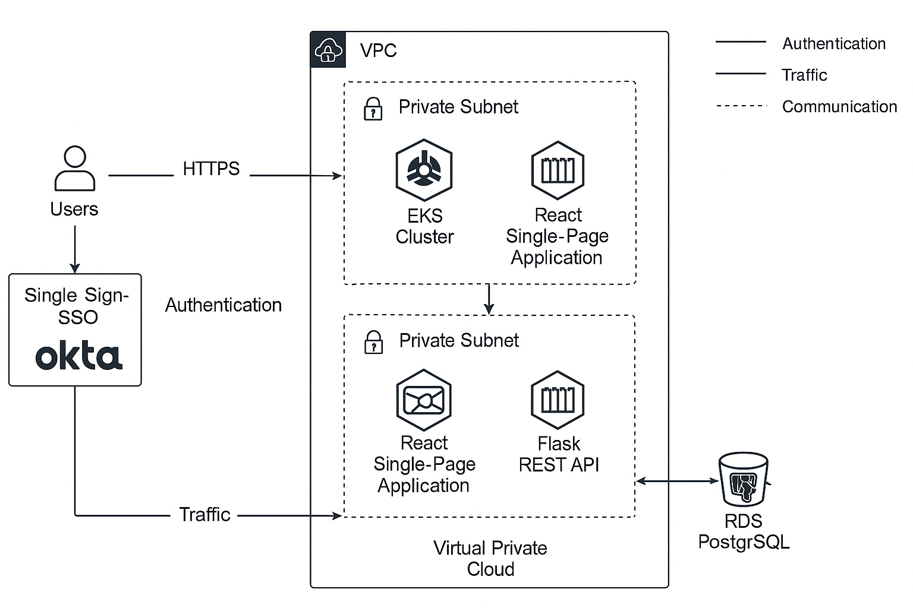

# 🚀 Innovate Inc. – Cloud Infrastructure Architecture

This repository contains the full architecture design for Innovate Inc.’s modern cloud-based web application. It follows AWS best practices to ensure a secure, scalable, cost-efficient, and production-ready platform using managed Kubernetes (EKS) and Infrastructure-as-Code (IaC).

---

## 📦 Project Overview

- **Application Type**: Web application (SPA frontend + REST API backend)
- **Tech Stack**: React (frontend), Python/Flask (backend), PostgreSQL (database)
- **Cloud Provider**: AWS
- **Environments**: Dev, Staging, Production
- **Traffic**: Scales from a few hundred to millions of users
- **Deployment**: Fully automated CI/CD with GitHub Actions
- **Security**: TLS, IAM, MFA, SSO (Okta), and private networking

---

## 🗺️ High-Level Architecture

---

## 📁 Repository Structure

| Path                          | Description                                                |
|-------------------------------|------------------------------------------------------------|
| `docs/01-cloud-provider/`     | Why AWS was selected and regional setup                    |
| `docs/02-org-structure/`      | AWS multi-account structure and account purposes           |
| `docs/03-network-design/`     | VPC, subnets, routing, NAT, gateways, and network security |
| `docs/04-compute-kubernetes/` | Amazon EKS, node groups, autoscaling, Karpenter            |
| `docs/05-database-postgresql-and-data-masking/` | PostgreSQL, backups, HA, data masking    |
| `docs/06-version-control-and-ci-cd-strategy/` | GitHub Actions, GitOps, deployment pipeline           |
| `docs/07-VPN-Provider/`       | AWS Client VPN + OpenVPN + AWS Transit Gateway             |
| `docs/08-SSO-Provider/`       | Okta SSO integration for centralized identity              |
| `docs/09-collaboration-tools/`| Jira and Confluence for tracking and documentation         |
| `docs/10-infrastructure-iac/` | AWS CloudFormation + SAM + OIDC-based GitHub Actions       |
| `docs/11-monitoring-alerting/`| CloudWatch, Prometheus, Alertmanager, and dashboards       |
| `docs/12-slack-integration/`  | Slack alerts for incidents and deployment visibility       |
| `docs/13-cost-estimate/ `     | Monthly AWS + third-party service cost breakdown           |

---

## 💰 Cost Estimate

- **AWS Services**: ~$1,683/month
- **3rd-Party Tools**: ~$320–395/month
- **Total Estimate**: ~$2,000/month  
→ See [13-cost-estimate/README.md](13-cost-estimate/README.md) for full breakdown.

---

## 🛡️ Key Security & Compliance Features

- Private subnets for EKS, RDS, and VPN
- IAM Roles for Service Accounts (IRSA)
- TLS everywhere (VPN, ALB, HTTPS endpoints)
- Centralized logging and auditing via CloudTrail and CloudWatch
- Okta-based MFA and SSO
- Network-level isolation per environment

---

## 📦 Summary

Innovate Inc.’s infrastructure is:

- ✅ **Secure** – TLS, IAM, SSO, private networking
- ✅ **Scalable** – EKS with HPA, Karpenter, and Spot optimization
- ✅ **Automated** – GitHub Actions for IaC and deployments
- ✅ **Auditable** – Centralized logs and tracked deployments
- ✅ **Cost-aware** – Spot usage, tagging, and Terraform/SAM automation

---

## 📎 License

MIT License – see [`LICENSE`](LICENSE) for details.
