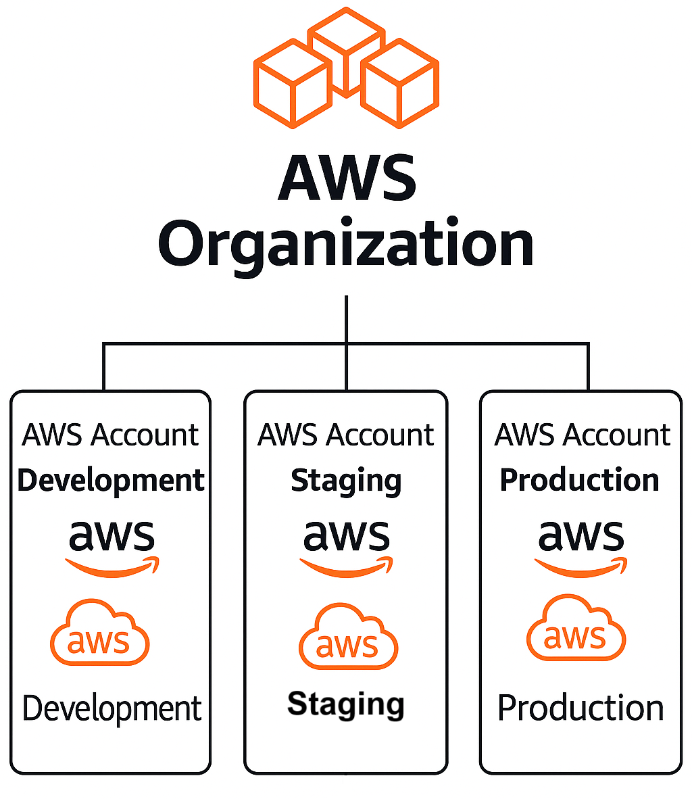

# ✅ Innovate Inc. – Multi-Account AWS Strategy

---

## 🌐 AWS Organization Structure

Innovate Inc. follows a **multi-account AWS Organization strategy** based on AWS security and operational best practices. Each environment is isolated in its own AWS account, ensuring clear separation of concerns, enhanced security, and better cost visibility.

| **Account**         | **Purpose**                          | **Access Model**                  |
|---------------------|--------------------------------------|-----------------------------------|
| `innovate-dev`      | Development & feature testing        | Developers, CI/CD pipelines       |
| `innovate-staging`  | QA, integration, and UAT testing     | DevOps, QA engineers              |
| `innovate-prod`     | Live production environment          | Ops team (full), others (read-only) |

---

## ✅ Key Benefits

- **Environment Isolation**: Limits blast radius by isolating workloads, permissions, and resources.
- **Cost Segmentation**: Enables per-account billing and easier cost tracking using consolidated billing.
- **Security Boundaries**: Supports account-specific IAM roles, SCPs (Service Control Policies), and guardrails.
- **Audit & Compliance**: Separate **CloudTrail**, **AWS Config**, and **VPC Flow Logs** per account.
- **Safe Deployments**: CI/CD pipelines are environment-aware, reducing the risk of accidental production deployments.

---

## ⚙️ Naming Convention Strategy

Adopting consistent naming conventions improves resource discoverability and operational efficiency.

| **Environment** | **Prefix Examples**                  |
|------------------|--------------------------------------|
| Development      | `dev-eks-cluster`, `dev-db`          |
| Staging          | `stg-app-alb`, `stg-rds`             |
| Production       | `prod-api`, `prod-vpc`               |

---

## 🧩 Future Expansion Options

As Innovate Inc. grows, the AWS Organization structure can scale to include additional accounts for centralized services and tighter control:

- **Shared Services Account**  
  Centralized monitoring (e.g., CloudWatch dashboards), CI/CD runners, backups, etc.

- **Audit/Logging Account**  
  Aggregation point for logs from all accounts: **CloudTrail**, **VPC Flow Logs**, **AWS Config**.

- **Security Account**  
  Central management of **IAM Identity Center**, **AWS GuardDuty**, and detective controls.

---

## 🚀 Summary

This multi-account setup provides Innovate Inc. with a secure, scalable, and auditable cloud foundation. It enables isolated environments, cost control, and room to grow while staying aligned with AWS Well-Architected best practices.

