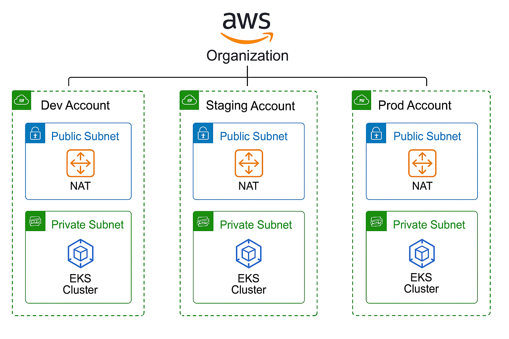

# ✅ Innovate Inc. – Kubernetes Compute Platform (Amazon EKS)

---

## 1. Amazon EKS Strategy

Innovate Inc. uses **Amazon Elastic Kubernetes Service (EKS)** to manage containerized applications across three environments — **Development**, **Staging**, and **Production**.

Each environment is isolated in its own AWS account and hosts a separate EKS cluster for **security**, **performance tuning**, and **resource control**.

| Environment    | Cluster Scope                       | Purpose                                    |
|----------------|--------------------------------------|--------------------------------------------|
| `innovate-dev` | Cost-optimized with auto-scale-down | Developer testing and CI/CD integration     |
| `innovate-staging` | Persistent medium-sized          | QA, UAT, production simulation              |
| `innovate-prod`| High availability, multi-AZ         | End-user facing, secure, scalable backend   |

---

## 2. Node Groups and Scaling

### ✅ Node Group Types by Environment

| Environment     | Node Type             | Count & Strategy                                          |
|-----------------|-----------------------|-----------------------------------------------------------|
| Production      | `c6i.xlarge` (On-Demand + Reserved) | 4–6 nodes, spread across AZs, buffer for traffic bursts  |
| Staging         | `t3.large` (Reserved)  | 2–3 nodes, persistent 24/7 for test parity                |
| Development     | `t3.medium` (Spot)     | 2 nodes, scales down to 0 during off-hours                |

---

## 🔁 EKS Scaling Strategies

### 🔹 Horizontal Pod Autoscaler (HPA)
- Enabled on all stateless apps (Flask APIs, React frontend)
- Based on CPU utilization or custom metrics (e.g., RPS)
- Tuned with `minReplicas` and `maxReplicas` per workload

### 🔹 Cluster Autoscaler
- Automatically scales worker nodes per environment
- Separate node groups for:
  - System/infra workloads
  - Application workloads (taints/tolerations)
- `minSize`, `maxSize`, and `desiredSize` managed per use case

---

## 🚀 Introducing Karpenter for Dynamic Scaling

Innovate Inc. leverages **AWS Karpenter** in Production and Development clusters to **automatically provision right-sized nodes** based on real-time workload demands. This complements and, in some cases, replaces the traditional Cluster Autoscaler approach.

### ✅ Why Karpenter?

| Feature                   | Benefit                                                       |
|---------------------------|---------------------------------------------------------------|
| Just-in-time provisioning | Instantly launches new nodes tailored to the pod’s needs      |
| Cost optimization         | Supports Spot + On-Demand mix, lifecycle-aware scheduling     |
| Reduced complexity        | No need to predefine multiple node groups                    |
| Flexible instance types   | Selects from a broad range of compatible EC2 types            |
| Automatic consolidation   | Reclaims underutilized nodes during low-traffic periods       |

---

### 🔧 Karpenter Setup Overview

- **Installed via Helm** with fine-grained IAM permissions (IRSA)
- Configured with multiple `Provisioners`:
  - Spot-preferred for `innovate-dev`
  - Balanced (On-Demand fallback) for `innovate-prod`
- Taints and labels used to separate system and application pods
- Consolidation enabled to reduce idle compute costs

---

### 📈 Real-World Usage

| Environment     | Strategy                             | Instance Types Used                   |
|-----------------|--------------------------------------|----------------------------------------|
| `innovate-dev`  | Spot-preferred, scale-to-zero        | `t3.medium`, `t3.large`, `m6a.large`   |
| `innovate-prod` | On-Demand fallback, availability-aware| `c6i.xlarge`, `m6i.large`, `r6a.large` |

Karpenter dynamically scales based on pod specs and scheduling requirements (CPU, memory, topology spread, etc.), making it ideal for cost-effective yet responsive compute provisioning.

---

## 🧱 EKS Network Design

- **Private endpoint** enabled for EKS control plane (especially in production)
- Worker nodes run in **private subnets**
- ALB Ingress Controllers manage public traffic routing via **Application Load Balancer**
- Security Groups restrict node-level and pod-level traffic

---

## 🐳 Containerization Strategy

### 🔹 Image Build & Deployment

| Stage              | Tool/Practice                            |
|--------------------|------------------------------------------|
| Dockerfile         | Multi-stage builds for Flask & React     |
| CI/CD              | GitHub Actions with Docker Buildx        |
| Registry           | AWS ECR (Elastic Container Registry)     |
| Tags               | Git SHA and SemVer for traceability      |
| Base Images        | Minimal images (e.g., `python:3.11-slim`) for size and security |

---

## 📦 Helm & GitOps Readiness

- Workloads packaged as **Helm charts**
- Cluster bootstrapping with **FluxCD** or ArgoCD (optional)
- Supports multi-environment config management via values files:
  - `values-dev.yaml`
  - `values-staging.yaml`
  - `values-prod.yaml`

---

## 🧠 Security Best Practices

- IAM Roles for Service Accounts (IRSA) to access S3, RDS, etc.
- EKS audit logging enabled for control plane actions
- PodSecurity Standards (restricted) applied in production
- Namespaces and RBAC for team/app isolation

---

## 📌 Summary

Innovate Inc.’s Kubernetes architecture via EKS ensures:

- ✅ Scalable, secure, and isolated workloads per environment
- ✅ Efficient cost management using Spot and Reserved instances
- ✅ Flexible workload management using autoscalers and Helm
- ✅ Secure deployments using OIDC, IRSA, and private networking
- ✅ Adaptive node provisioning using **AWS Karpenter**
