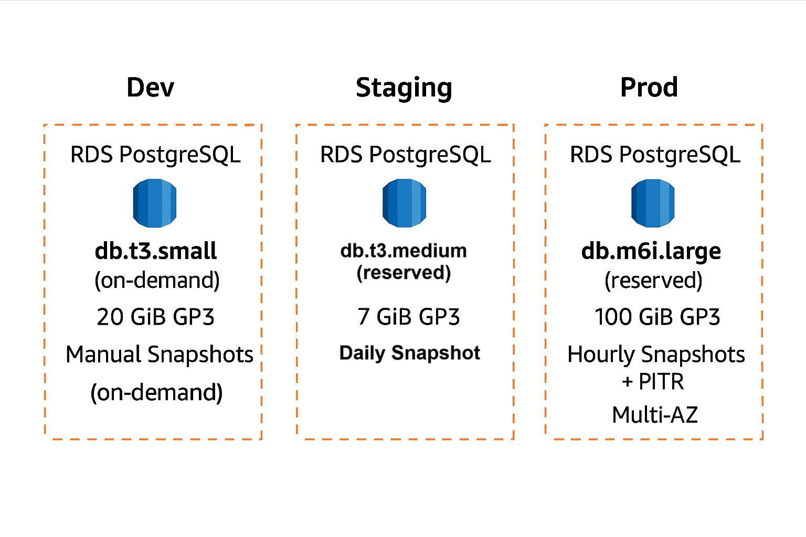
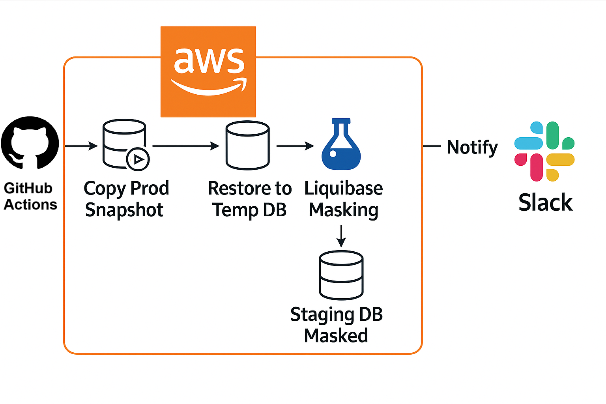

# ✅ Innovate Inc. – PostgreSQL Database Architecture (Amazon RDS)

---

## 1. Database Strategy

Innovate Inc. uses **Amazon RDS for PostgreSQL** as the managed database service across all environments — **Development**, **Staging**, and **Production**. Each environment maintains its own isolated RDS instance to ensure environment-specific performance, access, and backup requirements.

| Environment    | Instance Type      | Storage       | Availability          |
|----------------|--------------------|---------------|------------------------|
| `innovate-dev` | db.t3.small        | 20 GiB GP3    | Single-AZ (cost-optimized) |
| `innovate-staging` | db.t3.medium   | 50 GiB GP3    | Single-AZ              |
| `innovate-prod`| db.m6i.large       | 100 GiB GP3   | Multi-AZ (HA)          |

---

## ✅ Backup & Retention Strategy

| Environment    | Backup Type            | Retention      | PITR (Point-in-Time Recovery) |
|----------------|------------------------|----------------|-------------------------------|
| Dev            | Manual snapshots        | On-demand only | ❌                            |
| Staging        | Automated daily backup  | 7 days         | ❌                            |
| Production     | Hourly backups + PITR   | 30 days        | ✅                            |

- **Production backups** support PITR up to the second within the 30-day window
- Backups are **encrypted with AWS KMS**
- Snapshots are **tagged** for environment and retention management

---

## 🔐 Security & Access

### ✅ Network Access
- All RDS instances reside in **private subnets**
- Access is limited to:
  - EKS application nodes
  - GitHub Actions self-hosted runner (via VPN/NAT)
- No public IPs are assigned

### ✅ Authentication
- **IAM-based authentication** is enabled where possible (e.g., CI/CD)
- **AWS Secrets Manager** stores and rotates passwords for:
  - `admin_user`
  - `app_user`
  - `readonly_user`

---

## 👥 PostgreSQL User Roles

| Role Name     | Privileges         | Usage                                 |
|---------------|--------------------|----------------------------------------|
| `admin_user`  | Full access         | Schema changes, migrations             |
| `app_user`    | Read/write          | Application backend (Flask)            |
| `readonly_user` | SELECT only       | Dashboards, analytics                  |
| `dev_user`    | Limited read/write  | Used in dev environment only           |

> Roles are defined once and granted per environment. Default privileges and role inheritance are managed using `ALTER DEFAULT PRIVILEGES`.

---

## 📦 Best Practices Summary

| Practice                                 | Applied? |
|------------------------------------------|----------|
| IAM Authentication for CI/CD & App       | ✅       |
| RDS in private subnets only              | ✅       |
| Separate roles per environment           | ✅       |
| Secrets managed via Secrets Manager      | ✅       |
| Logging enabled (connections, DDL)       | ✅       |
| Encryption at rest + in transit          | ✅       |

---

## 🛡️ Disaster Recovery (Production)

| Feature                        | Configured? | Details                                               |
|--------------------------------|-------------|--------------------------------------------------------|
| PITR (Point-in-Time Recovery)  | ✅          | Up to 30 days back, second-level granularity           |
| Multi-AZ                       | ✅          | Automatic failover between availability zones          |
| Snapshot Lifecycle Policies    | ✅          | Tagged, retained for compliance                        |
| Cross-Region Snapshots         | 🔜          | Planned – enables region-level failover                |
| DR Test in Staging             | ✅          | Snapshots restored into staging to validate recovery   |

---

## 🧠 Data Masking (Staging Only)

To safely replicate production data for QA:

- RDS production snapshots are copied and restored into staging
- A **Liquibase-based masking pipeline** is applied:
  - Names/emails → randomized
  - KYC/docs → redacted
  - Tokens/secrets → replaced
- Masking is **automated via GitHub Actions** and logs are stored in CloudTrail

---

## 📌 Summary

Innovate Inc.’s PostgreSQL strategy on Amazon RDS provides:

- ✅ Environment isolation (Dev, Staging, Prod)
- ✅ Automated backups and disaster recovery in production
- ✅ Secure, IAM-authenticated database access
- ✅ GDPR/PII-compliant data masking for staging environments
