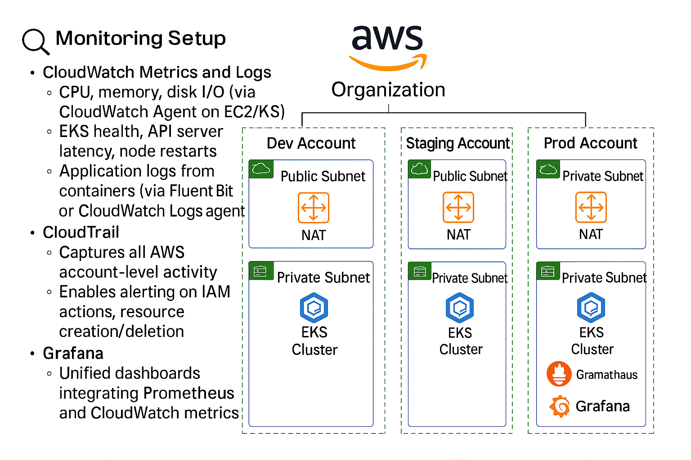

# 📊 Monitoring and Alerting Strategy – Innovate Inc.

---

## ✅ Purpose

To maintain high availability, reliability, and security across **Dev**, **Staging**, and **Production** environments, Innovate Inc. employs a multi-layered monitoring and alerting strategy. This approach enables fast detection, root cause analysis, and response to system events.

---

## 🧰 Core Tools and Responsibilities

| Tool               | Purpose                                                                 |
|--------------------|-------------------------------------------------------------------------|
| **Amazon CloudWatch** | Metrics, logs, custom dashboards, alarms across AWS services         |
| **Amazon CloudTrail** | API activity tracking for audit and security investigations           |
| **Prometheus**         | Metric collection from EKS clusters, pods, and services              |
| **Grafana**            | Visualization of Prometheus and CloudWatch data via dashboards       |
| **Slack**              | Real-time alert delivery for critical events and anomalies           |

---

## 🔍 Monitoring Setup

### ✅ CloudWatch Metrics and Logs
- System-level metrics: CPU, memory, disk I/O (via CloudWatch Agent)
- Kubernetes control plane metrics: API server latency, node health
- Application logs: collected from containers via Fluent Bit or CW Logs agent

### ✅ CloudTrail
- Logs all AWS API calls, including:
  - IAM actions
  - Resource provisioning and deletion
- Integrated with EventBridge for security-related alerts

### ✅ Prometheus
- Deployed to EKS via Helm
- Scrapes metrics from:
  - K8s nodes and pods
  - Services and apps
  - Exporters (e.g., node-exporter, kube-state-metrics)

### ✅ Grafana
- Unified dashboards combining CloudWatch + Prometheus
- Supports:
  - Real-time metrics
  - Annotations for deployments/incidents
  - Multi-tenant dashboarding (e.g., per team/environment)

---

## 🚨 Alerting Configuration

| Event Type                      | Tool         | Alert Target             |
|----------------------------------|--------------|---------------------------|
| Pod CPU > 85% (5 mins)           | Prometheus   | Slack `#devops-alerts`    |
| EKS node not ready               | Prometheus   | Slack                     |
| Unauthorized IAM change         | CloudTrail   | Slack via EventBridge     |
| Application 5xx error spike     | CloudWatch   | Slack                     |
| API latency > 1s (P95)          | CloudWatch   | Slack                     |
| OOMKilled pod restarts          | Prometheus   | Slack                     |

---

## 🧠 Slack Integration

- Alerts delivered to `#devops-alerts` channel
- **CloudWatch** uses **AWS Chatbot** for Slack notifications
- **Prometheus** sends alerts via **Alertmanager** → Webhook → Slack

---

## 📌 Summary

✅ Proactive monitoring across AWS and Kubernetes resources  
✅ Real-time alerting to reduce mean time to resolution (MTTR)  
✅ Slack integration for team-wide visibility and quick response  
✅ Unified dashboards and metric insights via Grafana  
✅ Audit and security trails via CloudTrail  
